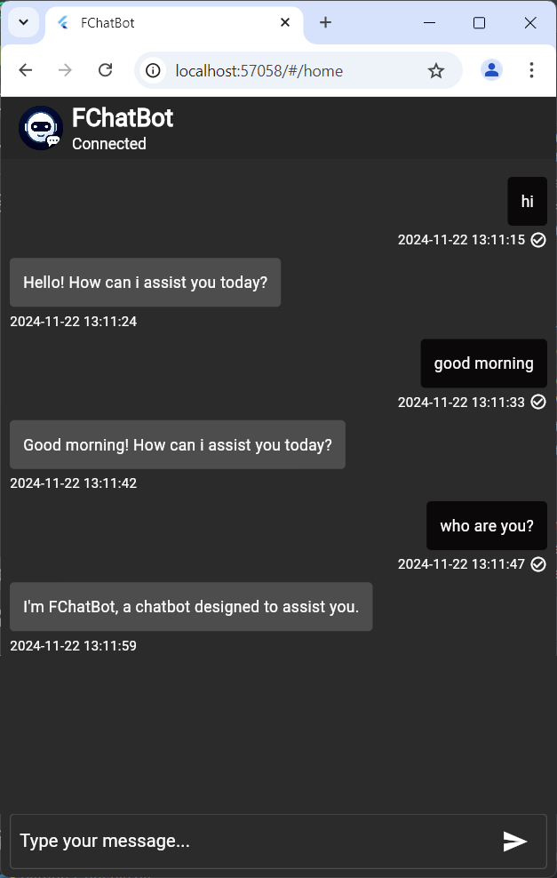

# FChatBot

A Flutter chatbot frontend trained with Albert and T5 for customer services.

## **Description**

This is a Flutter chatbot frontend trained with Albert and T5 for customer services. It is a powerful tool that can be used to automate customer service tasks and provide 24/7 support to your customers.

## **Features**

- **Natural language processing:** The chatbot can understand and respond to natural language queries.
- **Machine learning:** The chatbot is trained on a massive dataset of customer service interactions, so it can provide accurate and helpful responses.
- **24/7 support:** The chatbot can provide support to your customers 24 hours a day, 7 days a week.
- **Multilingual support:** The chatbot can be trained to support multiple languages.

## **Getting Started**

To get started, you will need to have Flutter installed on your machine. You can download Flutter from the official website: [https://flutter.dev/](https://flutter.dev/)

Once you have Flutter installed, clone this repository and run the following command to install the dependencies:

```bash
flutter pub get
```

Then, you can run the app using the following command:

```bash
flutter run
```

## **Screenshot**




## **Contributing**

We welcome contributions from the community! If you would like to contribute to this project, please fork the repository and submit a pull request.
